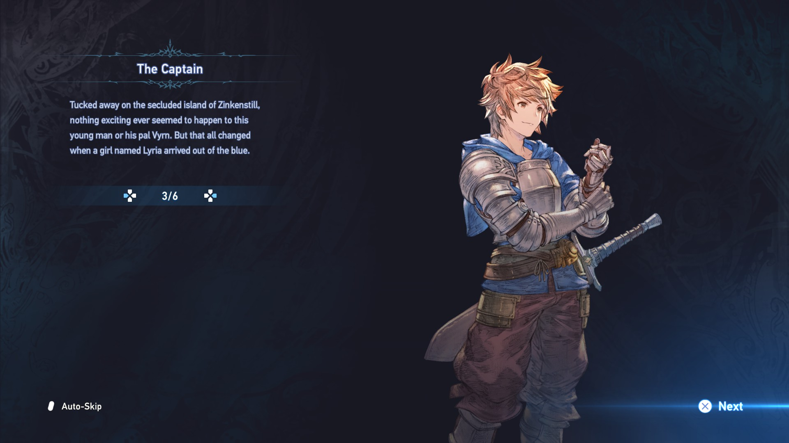
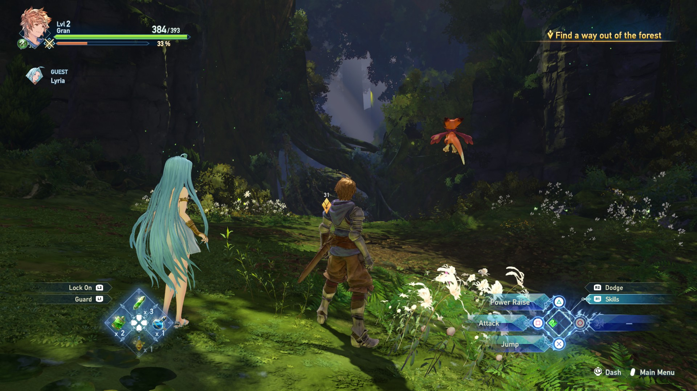
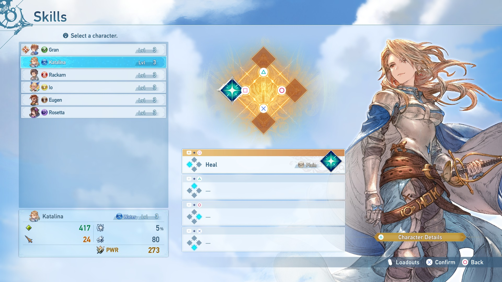
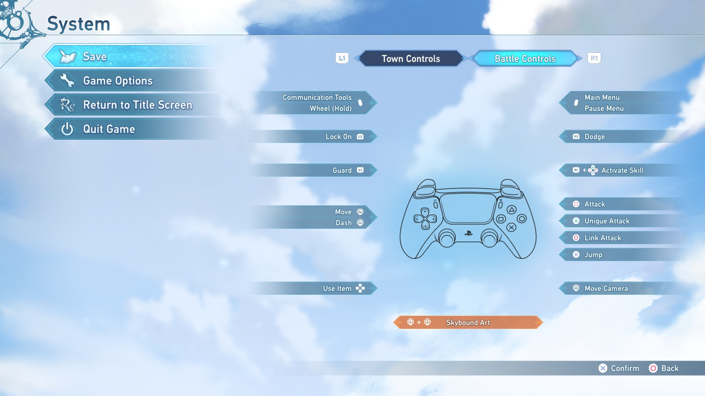

# Granblue Fantasy: Relink – DualSense Button Prompts

**Replaces Xbox controller button prompts with DualSense-styled ones**  
This mod updates the in-game UI to match PlayStation 5 controller inputs.

---

## 📦 Installation

This mod requires [Special K](https://www.special-k.info/). You can install it using either method below:

---

### 🔹 Method 1: Local install (via `dxgi.dll`)

1. Download the **archive version** of Special K.
2. Extract it into your **Granblue Fantasy: Relink** game directory.
3. Rename `SpecialK64.dll` to `dxgi.dll` (if it isn't already).
4. Move the provided `SK_Res` folder into the same directory (next to the game `.exe`).
5. Launch the game — the DualSense prompts should now be active.

---

### 🔹 Method 2: SKIF (Special K Injector Frontend)

1. Open **SKIF** and ensure injection is enabled.
2. In the game list, **right-click** on *Granblue Fantasy: Relink* and select **"Profile Folder"**.
3. Place the `SK_Res` folder inside that profile folder.
4. Launch the game — the new prompts will be loaded automatically.

---

## 🖼️ Previews

  
Click to expand

   
   
   
  

