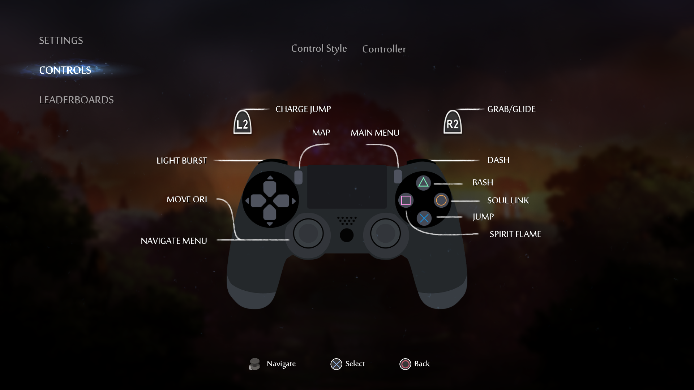

# Ori and the Blind Forest: Definitive Edition

**Replaces Xbox controller button prompts with DualShock 4 ones**  
This mod swaps the default Xbox-style button prompts with PlayStation DualShock 4 icons.

---

## 📦 Installation

1. **Backup your original files** – just in case you want to revert.
2. Extract the contents of this mod into your `oriDE_Data` folder.
3. Overwrite any existing files when prompted.

You're all set!

---

## 🖼️ Preview

  
Click to expand

  

